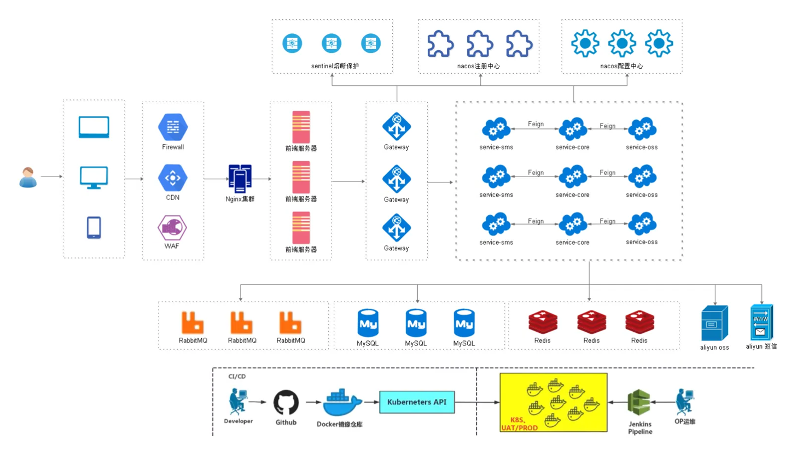
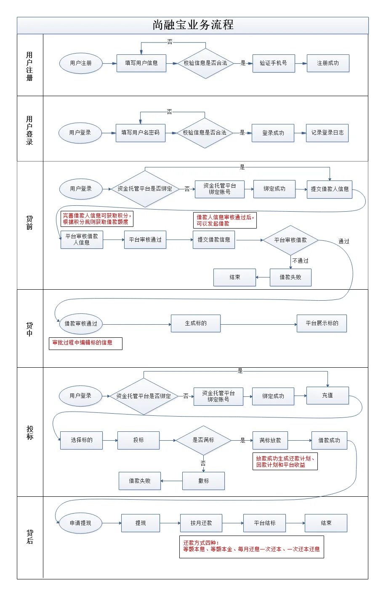

# 尚融宝后台

## 项目架构

## 业务流程图

## 前置知识和技术栈

**前置知识**

Java 基础、HTML、CSS、JavaScript、Spring、SpringMVC、MyBatis、SpringBoot、SpringCloud
Alibaba、MySQL、Redis、RabbitMQ、nginx、idea、maven

**后端技术栈**

- SpringBoot 2.3.4.RELEASE
- SpringCloud Hoxton.SR8：微服务基础设施 - 服务注册、服务发现、服务熔断、微服务网关、配置中心等
- SpringCloud Alibaba 2.2.2.RELEASE
- MyBatis Plus：持久层框架和代码生成器
- Lombok：简化实体类开发
- Swagger2：Api 接口文档生成工具
- Logback：日志系统
- Alibaba-EasyExcel：Excel 读写
- Spring Data Redis：Spring项目中访问 Redis 缓存
- HTTPClient: 基于 Http 协议的客户端，用来实现远程调用
- Spring Task：定时任务

**数据库和中间件**

- MySQL 5.7：关系型数据库，管理工具：Navicat
- Redis 5.0：缓存技术，管理工具：RedisDesktopManager
- RabbitMQ 3.8：消息中间件

**三方接口**

- 阿里云短信：短信网关
- 阿里云 OSS：分布式文件存储
- 资金托管平台 API 对接：汇付宝

**前端**

- Node.js： JavaScript 运行环境
- ES6：JavaScript的模块化版本
- Axios：一个发送 Ajax 请求的工具
- Vue.js：web 界面的渐进式框架
- Element-UI：前端组件库
- 模块化开发：解决 javascript 变量全局空间污染的问题
- NPM：模块资源管理器
- Vue-element-admin：基于 Vue.js 的后台管理系统 UI 集成方案
- Nuxt.js：基于 Vue.js 构建的服务器端渲染应用的轻量级框架

## 关联项目

- [srb-web](https://github.com/egu0/srb-web)：尚融宝管理后台
- [srb-site](https://github.com/egu0/srb-site)：尚融宝用户端
- [srb-hfb](https://github.com/egu0/srb_hfb)：第三方资金托管平台（汇付宝）

